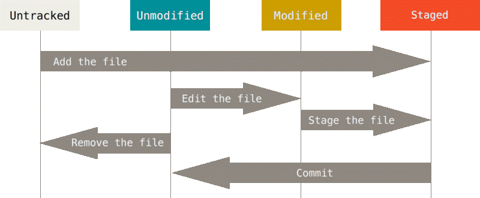

# Git e GitHub - Controle de versão

## Versionamento

O versionamento permite:

* Gerenciar o histórico dos arquivos;
* Facilita a colaboração durante o desenvolvimento;
* Marcar versões estáveis do código;
* Criar novas funcionalidades sem influenciar o código em funcionamento.

Possiveis problemas que podem aparecer sem a utilização do versionamento:

* Dificuldade em determinar qual a versão mais recento do seu código;
* Um colega trabalhar com uma versão do código diferente da sua;
* Muito tempo gasto para unificar o trabalho;
* Não conseguir regredir o projeto para um estado anterior ao o que estava antes de detectar um bug.

## Ferramentas de versionamento

* Mercurial
* Subversion
* **Git**

## Porque usar o Git

* Muito popular graças ao Github;
* Criado pelo mesmo criador do Linux;
* Grande maioria dos projetos open source estão no GitHub;
* Fácil de aprender e a utilizar;
* Trabalha com versionamento descentralizado.

## Centralizado vs Descentralizado

### Centralizado

O controle de versão centralizado segue a topologia em estrela, havendo apenas um único repositório central mas várias cópias de trabalho, uma para cada desenvolvedor. A comunicação entre uma área de trabalho e outra passa obrigatoriamente pelo repositório central.

No controle de versão centralizado há um único repositório e várias cópias de trabalho que se comunicam apenas através do repositório central.

Vantagens:

* Cópia inicial do repositório é rápida;
* Arquivos sempre na versão mais recente;
* Gerenciamento do acesso.

Desvantagens:

* Disponibilidade do repositório;
* Mais dificil para trabalhar com branches;
* Menos utilização em projetos mais atuais.

### Descentralizado (Git)

São vários repositórios autônomos e independentes, um para cada desenvolvedor. Cada repositório possui uma área de trabalho acoplada e as operações commit e update acontecem localmente entre os dois.

No controle de versão distribuído cada desenvolvedor possui um repositório próprio acoplado a uma área de trabalho. A comunicação entre eles continua sendo através de commit e update.

Um repositório pode se comunicar com qualquer outro através das operações básicas pull e push

Vantagens:

* Não requer repositório central;
* Velocidade em manipular o repositório;
* Flexibilidade no fluxo de trabalho;

Desvantagens:

* Curva de aprendizagem um pouco maior;
* Necessita um push para o repositório central;
* Clone inicial pode demorar.

## Como o git versiona os arquivos

Ao inicializar um repositório com o git (veremos a seguir com mais detalhes), é criado um diretório chamado .git nesse local. É nesse diretório que o git armazena todo o histórico desse diretório e seus outros objetos.

O diferencial do git está na forma que ele gerencia esses objetos com as versões dos arquivos. Enquanto os sistemas de versionamento tradicionais (SVN e Subversion por exemplo) armazenam o delta entre cada versão dos arquivos, o git vai um pouco além e cria um snapshot de toda a estrutura do repositório. Ao comparar os arquivos, caso seu conteúdo não tenha alterações, ele cria somente uma referência ao estado anterior.

**Versionamento Tradicional:**


**Versionamento do Git:**


## Versionamento com Git

Sistemas tradicionais precisam de conexão com o repositório central, contendo assim uma dependência com a disponibilidade de conexão para trabalhar com o repositório.

Já com o git, como os repositórios são descentralizados, o repositório local consegue funcionar sem a dependência do repositório central, eliminando a necessidade de utilizar uma conexão de rede para a maioria das operações, resultando num ganho interessante de performance.

Tudo que é armazenado no git, por fim, recebe uma assinatura única que identifica o estado daquela alteração. Esse pacote de alterações é o que chamamos de git object, uma estrutura simples de chave e valor que recebe um hash único do tipo SHA-1.

```bash
84b1da6351252587aa492b52f8696cd6d3b00373
```

Temos que ter em mente que tudo no git é associado a um hash único e não repetido

Ao trabalhas com o git nós só estamos acessando atalhos para esse hash.

## Configurando o Git

### Listando as configurações existentes

```bash
git config --list
git config [--global] -l
```

### Adicionando dados de usuário

```bash
git config --global user.name treinaweb-git
git config --global user.email treinaweb@outlook.com
```

### Verificar se existe chave SSH já criada

```bash
ls -al ~/.ssh
```

### Criando chave SSH

```bash
ssh-keygen -t rsa -b 4096 -C "your_email@example.com"
```

OBS: Ao criar a chave SSH podemos adicionar uma senha.

### Adicionando chave SSH

Habilitar o uso de chave SSH:

```bash
eval "$(ssh-agent -s)"
```

Adicionar a chave SSH:

```bash
ssh-add ~/.ssh/id_rsa
```

### Verificar chave SSH

Realiza o ctrl + c na chave SSH

```bash
clip < ~/.ssh/id_rsa.pub
```

## Fluxo de trabalho com git

Até que as alterações realizadas nos arquivos cheguem ao repositório, elas precisam passar por algumas etapas.

* Modificamos os arquivos no nosso diretório local (working directory)
* Colocamos essas modificações em uma área de staging
* Movemos toda a área de staging na forma de commit no repositório

De forma geral, utilizamos o git para fazer essas modificações entre estados dos arquivos, como vemos no gráfico abaixo:


O working directory são os arquivos que visualizamos ao navegar em nosso diretório usando o navegador de arquivos do nosso sistema operacional. A medida que vamos trabalhando vamos adicionando essas modificações para a área de staging e por fim podemos enviar para o repositório do git. É possível fazer também o fluxo contrário e alterar os arquivos do disco com o conteúdo do repositório, chamando esse processo de checkout.

Podemos até considerer os casos de novos arquivos que ainda não foram monitorados pelo git. Detalhando o fluxo anterior, imagine as iterações que podem ocorrer entre o working directory e nossa área de staging.

Usamos o commando git status para analisar as diferenças entre o que está no staging com nosso repository e o working directory.

O fluxo abaixo demonstra os estados que os arquivos podem estar dentro de nosso projeto utilizando o **git status**:

* **Untracked**: Novo arquivo;
* **Unmodified**: Arquivo não modificado;
* **Modified**: Arquivo modificado;
* **Staged**: Arquivo adicionado ao staged com o commando **git add**.



## Mudanças de estados entre arquivos

Para entender melhor, considere um arquivo já commitado para o repositório do git com o nome legumes.txt.

Esse arquivo tem o seguinte conteudo:


De acordo com os comandos do git que formos executando, esse conteúdo vai se alterar em cada uma das áreas:

Modificando o arquivo no sistema (working dir):


Executando **git add**


Executando **git commit** rotulando assim os arquivos do staged e deixando no repositório local.


## Ações dos comandos no fluxo básico


## Iniciando um repositório

### Criar repositório localmente

Inicia um repositório vazio em sua máquina, adicionando uma pasta chamada ".git"

```bash
git init
```

Iniciar um repositório central (bare), usado para armazenar outros repositórios, algo como os repositórios no github.

Os repositórios do tipo bare são usados para centralizar o trabalho de diversos outros repositórios que enviam objetos, ele propriamente não possui Working Dir e não permite trabalhar diretamente nele.

Um repositório bare não contem um working directory com checkout de código, em outras palavras, pense nele como somente um diretório ".git" (o banco de dados do Git) sem nada alem disto.

Usado para quando precisamos criar um servidor Git.

```bash
git init --bare
```

Para subir um repositório já iniciado na sua máquina para o github, podemos utilizar o comando abaixo para relacionar o repositório criado na nossa máquina, com o repositório presente no github

```bash
git remote add origin url-do-repositorio
```

Após isto só é preciso enviar os dados deste repositório para o github:

```bash
git push -u origin master
```

### Copiando um repositório para sua máquina

```bash
git clone url-do-repositorio
```

## Comandos básicos com git

### Status

Mostra o estado que os arquivos do repositório estão, alem de informar os próximos passos a serem realizados.

```bash
git status
```

Para um status mais resumido podemos usar o seguinte comando:

```bash
git status -s
git status -short
```

### Add

Adicionar arquivos editados para o staged

```bash
git add [<nome-dos-arquivos-editados>...]
// Para adicionar tudo
git add .
```

### Commit

Junta os arquivos no staged como um grupo de alterações e grava isto no repositório local.

```bash
git commit [-m "Explicação das alterações executadas nos arquivos do staged"]
```

Caso queira adicionar diretamente todos os arquivos alterações do workspace como um commit para o repositório local, sem a utilização do **git add**, podemos utilizar o seguinte comando:

```bash
git commit -a [-m "Explicação das alterações executadas nos arquivos do staged"]
```

### Push

Envia os commits gravados no repositório local para o repositório remoto, onde o origin é o remote e o master é a branch.

```bash
git push [origin master]
```

### Pull

Recebe os commits (alterações) que estão no repositório remoto para o repositório local.

```bash
git pull [origin master]
```

### Fetch

Atualiza as referencias com um repositório remoto

```bash
git fetch origin
```

## Gitignore

É utilizado para bloquear o envio de certos arquivos para o repositório, onde estes são somente necessários durante o desenvolvimento.

Podemos bloquear estes arquivos com o arquivo **.gitignore**, onde todos os nomes dos arquivos ou pastas adicionados dentro dele, serão ignorados pelos comandos do git, podendo tambem ser adicionados nomes com regex.

Pode-se criar um arquivo **.gitignore** global para que assim, todos os seus repositórios ignorarão os arquivos adicionados dentro do **.gitignore** global.
Este arquivo fica como padrão armazenado em **$HOME/.config/git/ignore**, sendo utilizado principalmente para ignorar certos arquivos criados de IDEs ou arquivos que o sistema operacional cria por exemplo.
Para criar um **.gitignore** global especifico, podemos usar o comando:

```bash
git config --global core.excludesfile ~/.gitignore_global
// Para verificar se foi criado dentro das configurações globais
git config --global --get core.excludesfile
```

Podemos criar um arquivo **.gitignore** dentro da pasta raiz do nosso repositório local, assim podemos ignorar arquivos especificos deste repositório, alem de poder deixar o arquivo **.gitignore** dentro do repositório remoto, para que outros usuários tambem ignorem os arquivos selecionados.

Quando precisamos remover um arquivo que já foi comitado, onde não precisamos ele mais dentro do repositório, podemos usar o comando:

```bash
git rm <nome-do-arquivo>
```

### Pattens avançados de ignore

* **#** : A cerquilha marca um comentário em nosso arquivo;
* **-** : Ignora partes do nome de um pattern, agindo como um coringa;
* **!** : Permite que um determinado pattern seja excluído. Geralmente vem acompanhado de outra regra mais genérica;
* **/** : Tem função diferente dependendo da sua localização. No início da linha, ignora um pattern somente naquele diretório, mas não em seus subdiretórios. No final ignora toda a árvore do diretório;
* **\\** : A barra invertida atua como um caractere de escape;
* ****** : Dois asteriscos em seguida são usados para ignorar um pattern específico dentro de uma árvore de diretórios.

Exemplos:

Ignora todos os arquivos **html** do repositório

```bash
*.html
```

Exceto do arquivo **index.html**

```bash
!index.html
```

Ignora o README no diretório atual, mas permite **subdir/README**

```bash
/README
```

Ignora todos os arquivos no diretório **build/**

```bash
build/
```

Ignora os arquivos **.txt** do diretório **doc/**, mas permite subdiretórios (doc/server/arch.txt)

```bash
doc/*.txt
```

Ignora todos os arquivos **.pdf** na árvore **doc/**

```bash
doc/**/*.pdf
```

## Branches

Um dos pontos chave para trabalhar com git é entender o conceito de branches. Com ele podemos criar toda uma linha de commits e trabalhar em diferentes linhas de desenvolvimento.

Entenda como linhas de desenvolvimento o conjunto de alterações em conteúdos do projeto na forma de commits, gerando entre eles uma relação de hierarquia, como os commits em cinza, onde um se interliga ao outro. Esses commits acabam gerando uma espécie de árvore, onde cada ramificação (branch) vai se espalhando a partir de um ponto base:


Representação de um branch (em amarelo).

### Criando uma branch

Criamos uma outra branch a partir dos arquivos da branch que estamos atualmente utilizando o seguinte código:

```bash
git branch <nome-da-nova-branch>
```

### Criar uma branch e mudar para ela

```bash
git checkout -b <nome-da-branch>
```

### Listar as branchs criadas

Ao listar as branch criadas, podemos ver qual a branch na qual estamos situado.

```bash
git branch
```

### Mudar de branch

```bash
git checkout <nome-da-brach-criada>
// Retornar para branch anterior da atual acessada
git checkout -
```

### Sincronizar branch criada no repositório local com o repositório remoto

Ao realizar a sincronização, a branch criada será adicionada ao repositório remoto, contendo assim a sua referência.

```bash
git push --set-upstream origin <nome-da-branch>
```

### Remover branch

Para remover a branch do repositório local, primeiro temos que sair da branch a ser removida.
Após isto podemos executar o comando a seguir

```bash
git branch --delete <nome-da-branch>
git branch -d <nome-da-branch>
```

Agora para remover a branch do repositório remoto, usamos o seguinte código:

```bash
git push --delete origin <nome-da-branch>
```

### Curiosidades

A referência HEAD no git é dinâmica e aponta para o último commit da branch atual.

Diferente de outros sistemas de versionamento, as branches são simplesmente ponteiros para um commit (snapshot) em nosso repositório. Logo a criação de muitas branches não influência no tamanho do repositório tão pouco no seu desempenho.


Tenha em mente também a hierarquia criada pelos commits. Um commit não pertence a uma branch, pois o mesmo é só uma referência a uma hierarquia de snapshots, que podem ser combinados de volta com a branch de origem (merge). Ao criar o merge, os commits seguintes terão um mesmo commit base e a referência da branch anterior deixa de existir.

### Tipos de Fluxos

Existem basicamente dois tipos de fluxos que podemos utilizar, o gluxo de merge e o fluxo do rebase.

O **fluxo de merge** é o que utiliza o 3-Way Merge, ou seja, toda vez que um branch é mergeado ele adiciona um terceiro commit referente a união de 2 branches, conforme a imagem abaixo:


Já o fluxo de rebase apenas um commit é criado sem manter o histórico da existência de uma outra branch, o que também é conhecido como histórico linear. Veja a imagem abaixo:


### Merge

#### Tipos de Branches

Podemos dividir as branchs em algumas categorias:

* **Branches Pública e Local**: Quando criamos uma branch em nosso repositório local, podemos ou não enviá-la para um repositório remoto. Caso essa branch seja enviada para outro repositório ela passa a ser uma branch pública. Por ser uma branch onde outros usuários podem basear seus trabalhos, temos que tomar cuidado ao modificar o histórico dos commits.

* **Temporárias ou Permanentes**: Na questão de duração de uma branch, ela pode ter sido criada para uma funcionalidade específica para depois ser combinada ou essa branch pode existir durante todo o ciclo de vida do projeto, dependendo da estratégia adotada. Um exemplo de uma branch permanente comum é a branch _master_ e cada funcionalidade pode ser criada numa branch temporária, como uma _feature/*_

Outro ponto importante é a forma como combinamos essas branches. Temos duas formas para isso, usando um workflow baseado em _merge_ ou baseado em _rebase_, como veremos a seguir.

#### Utilizando o merge

Utilizado para combinar dois branches.

Entra na branch que deseja que os arquivos alterados sejam enviados

```bash
git checkout <nome-da-branch-1>
```

E após isto combina com uma outra branch

```bash
git merge [no-ff] <nome-da-branch-2>
```

Dependendo dos commits das duas branches, na hora de efetuar o merge podemos ter duas situações: um merge do tipo **fast forward** ou outro com um commit de merge (**3-way merge**).

#### Fast Foward

O merge por **fast forward** simplesmente move a referencia da branch que estamos trabalhando com o HEAD da branch a ser combinada. Isso gera um histórico de commits linear.


Como a branch _some feature_ tem como origem o HEAD do master, ao efetuar o merge só é preciso mover a referência do master para o novo commit (HEAD de _some feature_).

#### 3-Way Merge

Mas em alguns casos não será possível combinar as branches com fast forward, principalmente se a branch corrente tiver novos commits que não fazem parte da branch a ser combinada. Nessas situações o git utiliza um commit extra que junta essas duas branches distintas. Esse tipo de merge é conhecido também como _3-way merge_ pois ele utiliza 3 commits para gerar o merge, o HEAD das duas branches e o commit de merge que junta essas duas branches.


### Rebase

O rebase possibilita recriar o histórico de commits alterando suas mensagens, combinando muitos commits em um, descartando completamente algumas alterações e alterando a hierarquia dos commits, mudando a base de uma série de commits.

Pelo fato de alterar as referências dos commits do git, precisamos de certa cautela ao fazer o rebase.

#### Utilizando o Rebase

Primeiro buscamos os commits a frente que estão presente no repositório remoto utilizando o comando abaixo:

```bash
git pull --rebase [origin master]
```

O parâmetro _--rebase_ é utilizado para fazer um _fast forward_ caso já haja commits na branch escolhida, permanecendo assim um fluxo em linha. Caso não utilize-o, é possivel que o pull realize um _3-Way Merge_.

Para realizarmos o _rebase_, entramos na branch que será anexada a outra (branch-1) e realizaremos o seguinte código:

```bash
git rebase <nome-da-branch-que-recebera-os-commits>
```

Após usar o comando _rebase_, utilizamos o merge para juntar as 2 branches, agora que está preparado o fluxo para executar o _fast forward_ do _merge_

```bash
git merge <nome-da-branch-com-os-dados-a-serem-anexados>
```

OBS: Após a execução do _rebase_ os commits da branch anexada são excluidas (tem novas hashs) pois foram anexadas a branch alvo.

#### Rebase iterativo

Podemos tambem realizar um rebase iterativo, onde pode-se alterar a ordens dos commits, nomes, etc

```bash
git rebase <nome-da-branch-que-recebera-os-commits> -i
```

Para realizar as ações dentro do rebase iterativo, usamos os seguintes comandos:

* **p, pick**: usa o commit daquela linha;
* **r, reword**: usa o commit e permite a edição da sua mensagem;
* **e, edit**: usa commit, fazendo uma pausa para adicionar mais alterações (-ammed)
* **s, squash**: usa as alterações do commit, juntando ela com o commit anterior;
* **f, fixup**: parecido com squash, porém desconsidera a mensagem de log do commit;
* **x, exec**: executa um comando na linha de comando (útil para automatizações);
* **d, drop**: remove o commit.

#### Cancelar Rebase

```bash
git rebase --abort
```

## Histórico de commits

```bash
git log
```

Caso queira customizar a listagem dos commits, podemos utilizar as seguintes flags:

* **--oneline**: Condensa o histórico de commits em uma linha por commit;
* **--color**: Tenta colorir o output para um resultado mais agradável
* **--graph**: Monta o gráfico das branchs em modo texto;
* **--abbrev-commit**: Abrevia o hash do commit. A flag do **--oneline** já faz isso;
* **--pretty**: Permite que sejam utilizados placeholders para as informações dos commits. A lista completa de opções você entra ao executar git log --help

Exemplo:

```bash
git log --color --graph --pretty=format:'%Cred%h%Creset -%C(yellow)%d%Creset %s %Cgreen(%cr) %C(bold blue)<%an>%Creset' --abbrev-commit
```


Se preferir, é possível definir apelidos para os comandos internos do git, assim temos um log customizado e de fácil execução:

```bash
git config --global alias.lg "log --color --graph --pretty=format:'%Cred%h%Creset -%C(yellow)%d%Creset %s %Cgreen(%cr) %C(bold blue)<%an>%Creset' --abbrev-commit"
```

Podendo assim executar o seguinte comando:

```bash
git lg
```

## Commandos Extras

### Verificar versão do git instalada

```bash
git --version
```
